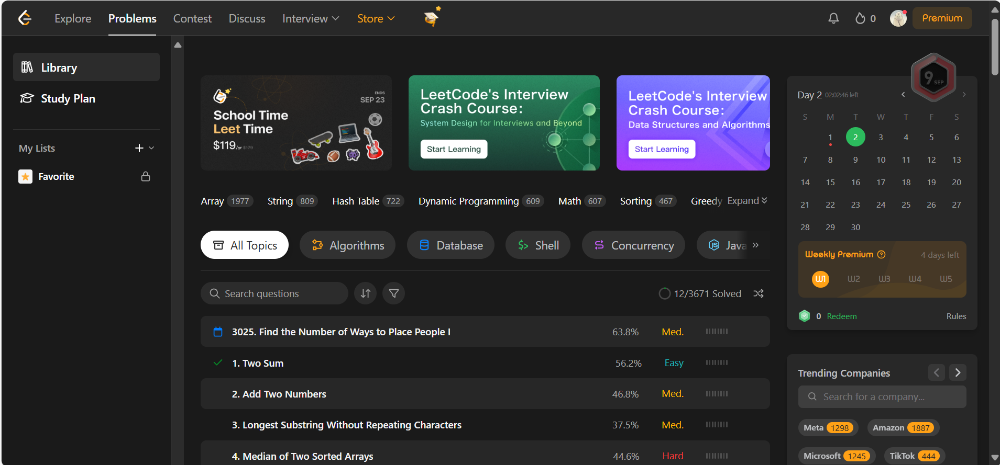
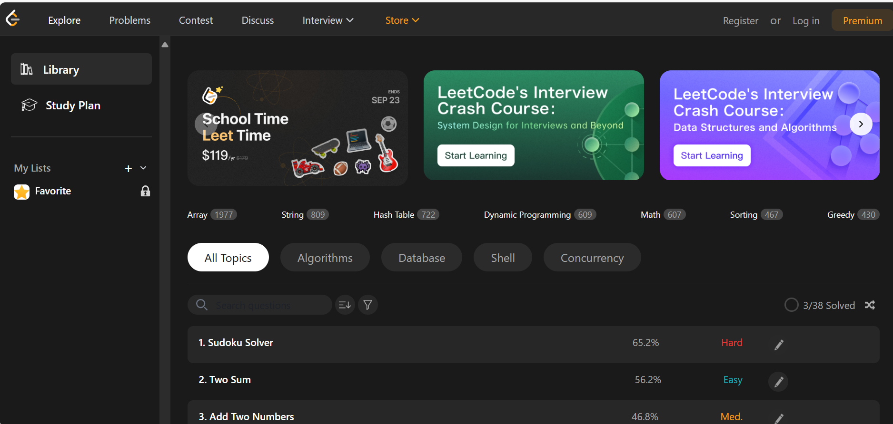
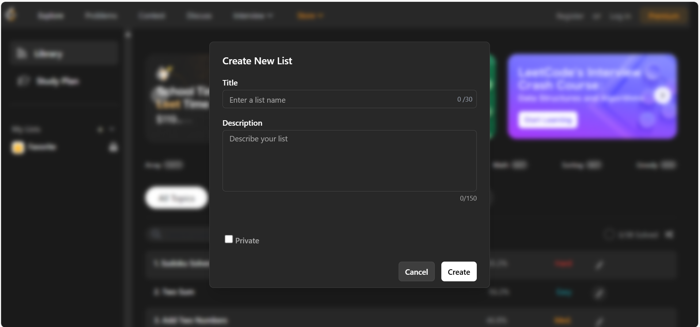
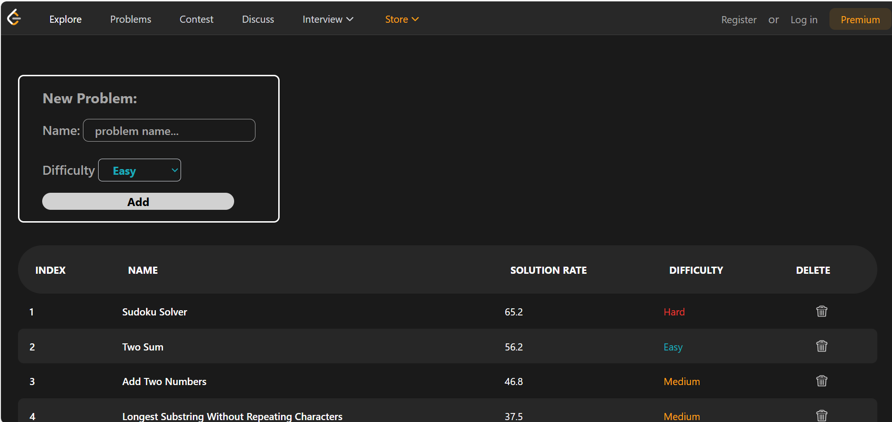
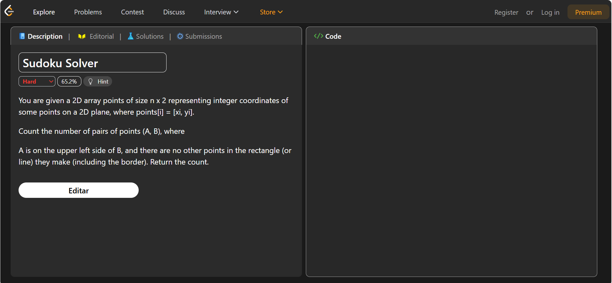

# Exercício 02

## Descrição

Clone do [LeetCode](https://leetcode.com/problemset/) adaptado para as tecnologias de aula (`python` com `flask` e motor gráfico `Jinja2`)

- Adicionei interação com a [API Pública de execícios do LeetCode](https://leetcode-api-pied.vercel.app/)
- Adicionei interação com a biblioteca [AbacatePay](https://www.abacatepay.com/) (Gateway de Pagamento)

## 🔗 Rotas Disponíveis

### `GET` & `POST` `/`

- **Descrição:** Página inicial da aplicação.
- **GET:**
  - Renderiza a lista `my_list` e `problems_list`.
- **POST:**
  - Cria um novo item em `my_list` com os dados enviados no formulário (`inputTitle`, `inputDescription`, `inputIsPrivate`).
  - Redireciona para `/`.

---

### `GET` `/edit_problems_list`

- **Descrição:** Página de edição da lista de problemas (`problems_list`).
- Renderiza `edit_problems_list.html`.

---

### `DELETE` `/remove_item/<problem_name>`

- **Descrição:** Remove um problema da lista `problems_list` pelo nome (`problem_name`).
- **Parâmetro:**
  - `problem_name` (string) → nome exato do problema a ser removido.

---

### `POST` `/add_problem`

- **Descrição:** Adiciona um novo problema à lista `problems_list`.
- **Campos esperados (form):**
  - `nameInput` → Nome do problema
  - `difficultInput` → Dificuldade (Easy, Medium, Hard)
- Novo item é adicionado na primeira posição da lista com `solutionPercent = 0.0` e `done = False`.
- Redireciona para `/edit_problems_list`.

---

### `GET` & `POST` `/edit_single_problem/<name>`

- **Descrição:** Edição individual de um problema.
- **GET:**
  - Renderiza `edit_single_problem.html` com os dados do problema selecionado.
- **POST:**
  - Atualiza os campos `name`, `difficulty` e `solutionPercent` do problema.
  - Redireciona para `/`.

---

### `GET` & `POST` `/store`

- **Descrição:** Integração com **AbacatePay PIX**.
- **GET:**
  - Renderiza `store_page.html` com o QR Code PIX (`pix_qr.brcode_base64`) e status de pagamento.
- **POST:**
  - Simula o pagamento do PIX (`client.pixQrCode.simulate(pix_qr.id)`).
  - Atualiza `isPaid = True`.
  - Renderiza a mesma página com status atualizado.

---

### `GET` `/real_problems`

- **Descrição:** Lista problemas reais da API pública **LeetCode**.
- **Fonte:** `https://leetcode-api-pied.vercel.app/problems`
- Renderiza `real_problems.html` com a lista de problemas.

---

### `GET` `/real_problems/<title_slug>`

- **Descrição:** Detalhes de um problema específico do **LeetCode**.
- **Parâmetro:**
  - `title_slug` (string) → identificador único do problema (ex: `two-sum`).
- **Fonte:** `https://leetcode-api-pied.vercel.app/problem/<title_slug>`
- Renderiza `real_problem_info.html` com os dados do problema.

---

## 🛠️ Dependências

- [Flask](https://flask.palletsprojects.com/)
- [abacatepay](https://pypi.org/project/abacatepay/)
- `json` (nativo do Python)
- `urllib` (nativo do Python)

---

### Inspiração:

### Resultado:

## Funcionalidades:

### Adicionar Lista Customizada:

### Adicionar Problema(Exercício):

### Editar Problema:

